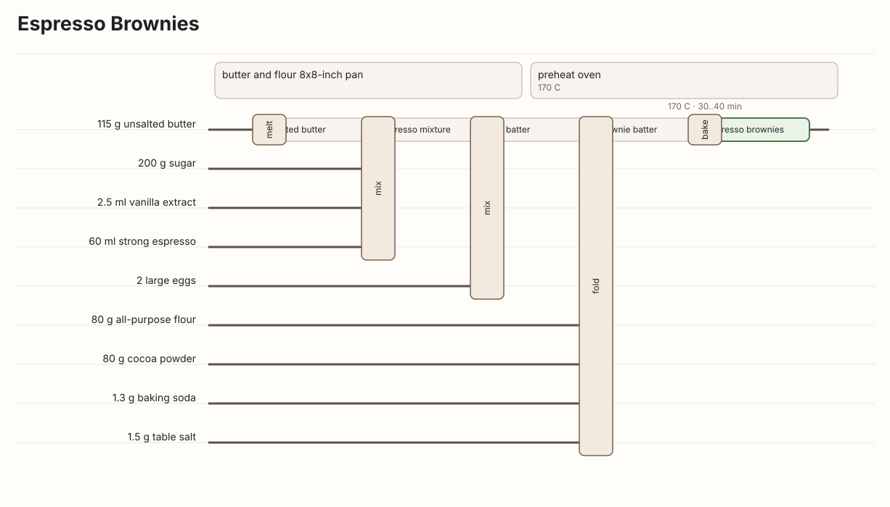
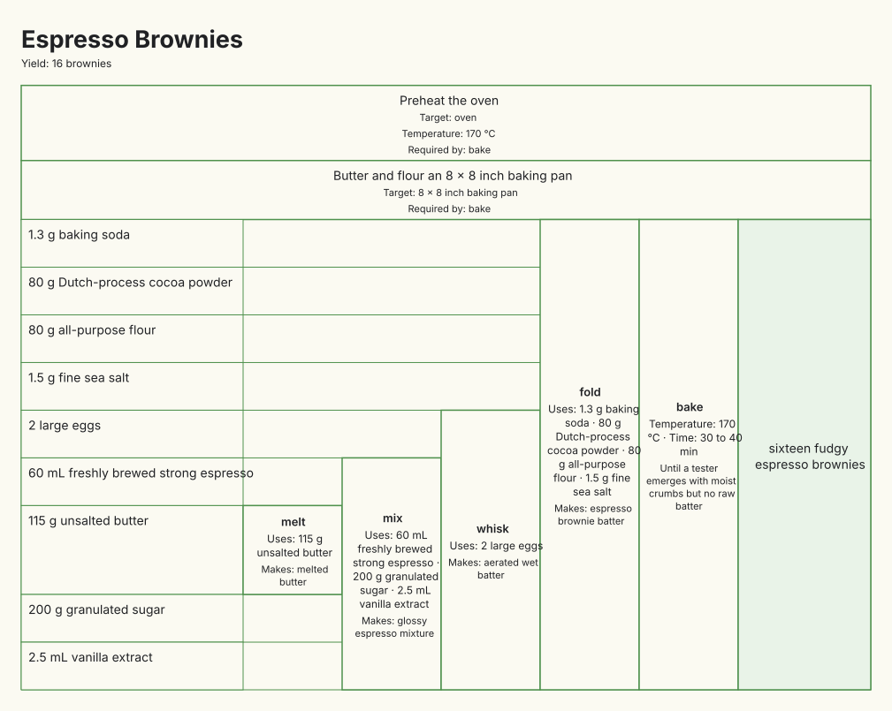
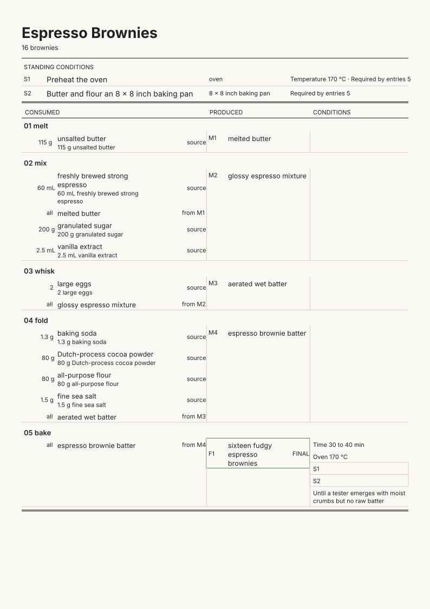

# RecipeFlow

[](https://github.com/ThomasRohde/recipeflow/actions/workflows/ci.yml)
[](https://github.com/ThomasRohde/recipeflow/actions/workflows/pages.yml)

See the three views in practice at the [Potato Index](https://thomasrohde.github.io/recipeflow/),
a growing field guide to potato cookery: crisp, mashed, layered, stuffed, simmered, baked,
and fried across kitchens around the world.

The companion [potato buying guide](https://thomasrohde.github.io/recipeflow/potato-guide.html)
translates Yukon Gold, russet, waxy, and floury recipe terms into local shopping guidance,
with detailed coverage for Denmark, Scandinavia, and Europe.

Recipes look linear on paper. Cooking is not. Flour becomes dough. A hot oven is
required, but never consumed. Part of a sauce may be held back, then rejoin the dish at
the end.

RecipeFlow is a small YAML language for describing those relationships plainly. It
validates a recipe, compiles it into a typed graph, and renders that graph as SVG, HTML,
PNG, or text.



## One recipe, three useful views

Every notation below is generated from the same compiled recipe graph. Choosing a view
changes the presentation, not the meaning.

### Flow

The default view follows ingredients and intermediate states from left to right. It is
best when the transformation sequence matters most.

### Compact table

The compact table keeps ingredients in rows and lets operations span exactly the rows
they consume. It is good for seeing, at a glance, which ingredients belong to each step.



### Kitchen Ledger

The ledger is the audit view. Each entry states what it consumes, what it produces, what
must already be true, and what remains held for later. It can be rendered as a continuous
screen layout or paginated for print.



## Install

RecipeFlow requires Python 3.12 or newer.

~~~powershell
python -m pip install recipeflow
~~~

PNG output uses the optional rendering dependency:

~~~powershell
python -m pip install "recipeflow[png]"
~~~

For a source checkout:

~~~powershell
uv sync --extra dev --extra png
uv run recipeflow --help
~~~

## First document

A RecipeFlow document names the materials that exist before, during, and after cooking.
Operations consume material inputs and produce new material states.

```yaml
recipeflow: 1
recipe:
  id: quick-flatbread
  title: Quick Flatbread
  yield: 4 flatbreads
ingredients:
  flour: {label: all-purpose flour, quantity: 250 g}
  water: {label: warm water, quantity: 150 ml}
  salt: {label: fine salt, quantity: 1 tsp}
operations:
  - id: mix-dough
    action: mix
    inputs: [flour, water, salt]
    outputs:
      dough: {label: soft dough}
  - id: cook
    action: cook
    inputs: [dough]
    duration: 4 min
    until: browned in spots
    notes:
      - Cook each side for about 2 min.
    outputs:
      flatbreads: {label: cooked flatbreads, role: final, final: true}
```

Save it as <code>quick-flatbread.recipe.yaml</code>, then ask RecipeFlow to check it:

~~~powershell
recipeflow validate quick-flatbread.recipe.yaml
recipeflow render quick-flatbread.recipe.yaml --format tabular-svg --output flatbread.svg
~~~

## The mental model

RecipeFlow makes three distinctions that recipe prose often blurs:

- **Inputs are physical materials.** Flour, melted butter, batter, reserved cream, and
  baked cake all travel through the graph.
- **Requirements are conditions.** A preheated oven or prepared tin must exist before an
  operation can begin, but it is not food and is not consumed.
- **Outputs are new states.** Mixing does not merely finish a step; it creates dough,
  batter, filling, or another named material that later operations can use.

That distinction is what makes branching, reserving, recombining, optional garnish,
waste, and multiple outputs unambiguous.

## CLI

The command line is a thin interface over the library:

~~~powershell
recipeflow validate examples/espresso-brownies.recipe.yaml --json
recipeflow inspect examples/espresso-brownies.recipe.yaml
recipeflow render examples/espresso-brownies.recipe.yaml --format tabular-svg --output brownies.svg
recipeflow render examples/espresso-brownies.recipe.yaml --format tabular-svg --notation compact-table --output brownies-table.svg
recipeflow render examples/espresso-brownies.recipe.yaml --format tabular-png --notation ledger --page-size A4 --print-mode --output brownies-ledger.png
recipeflow render-check examples/espresso-brownies.recipe.yaml --json
~~~

JSON mode writes one stable envelope to stdout. Diagnostics and human-readable progress
go to stderr. See the [CLI contract](docs/CLI.md) for formats, options, and exit codes.

## Python library

Core APIs accept strings and in-memory objects; they do not require filesystem access.

```python
from recipeflow import build, render

source = """
recipeflow: 1
recipe: {id: tea, title: Tea}
ingredients:
  water: {label: water, quantity: 250 ml}
  leaves: {label: tea leaves, quantity: 2 tsp}
operations:
  - id: steep
    action: steep
    inputs: [water, leaves]
    duration: 4 min
    outputs:
      tea: {label: brewed tea, role: final, final: true}
"""

result = build(source)
if not result.ok:
    for diagnostic in result.diagnostics:
        print(diagnostic.code, diagnostic.path, diagnostic.message)
else:
    assert result.graph is not None
    svg = render(result.graph, "tabular-svg")
    print(svg.media_type)
```

The [public API guide](docs/PUBLIC-API.md) covers parsing, validation, compilation,
analysis, layout strategies, rendering, and semantic diff. The
[SDK examples](examples/sdk) are executable.

## Authoring recipes

The repository includes a Codex skill at
[recipeflow-author](.agents/skills/recipeflow-author/SKILL.md). Give it a recipe source
and invoke <code>$recipeflow-author</code>; it will preserve the source evidence, write
RecipeFlow YAML, validate and compile it, render the requested notation, and inspect the
result for semantic or visual mistakes.

The skill handles interpretation. The RecipeFlow library does not. This boundary is
intentional: the same deterministic compiler and renderer can sit behind a person, an
editor, an import pipeline, or an authoring agent.

## What RecipeFlow will not invent

RecipeFlow does not fetch web pages, run OCR, invoke a model, or decide what ambiguous
recipe prose means. It preserves authored wording and uncertainty. Normalized units and
durations may sit beside the source values, but never replace them without evidence.

Expected authoring mistakes produce structured diagnostics rather than generic
exceptions. Unknown facts remain unknown.

## What you can rely on

- Every ingredient use and intermediate transfer is an explicit graph edge.
- Setup conditions cannot silently become food inputs.
- Source wording, provenance, quantities, and ambiguity survive compilation.
- Layout is renderer-neutral; PNG is rasterized from the same geometry as SVG.
- Schemas and TypeScript declarations are versioned, reproducible public contracts.
- Rendering is deterministic within its declared font and raster environment.
- Visible text is never deliberately clipped or truncated.

## Documentation

- [Language reference](docs/LANGUAGE.md) — the YAML model and its semantics
- [Public Python API](docs/PUBLIC-API.md) — supported imports and return types
- [CLI contract](docs/CLI.md) — commands, output envelopes, and exit codes
- [Architecture](docs/ARCHITECTURE.md) — boundaries and design decisions
- [Tabular notation](docs/TABULAR-NOTATION.md) — shared visual semantics
- [Layout engine](docs/LAYOUT-ENGINE.md) — geometry, typography, and validation
- [Visual quality](docs/VISUAL-QUALITY.md) — golden corpus and rendering gates
- [Schema versioning](docs/SCHEMA-VERSIONING.md) — compatibility policy

## Development

~~~powershell
uv sync --extra dev --extra png
make check
~~~

On Windows without <code>make</code>, run the individual commands listed in
[the contributing guide](docs/CONTRIBUTING.md). CI exercises the portable suite on
Linux and Windows and shards the canonical render corpus by fixture.

RecipeFlow is available under the [MIT License](LICENSE).
